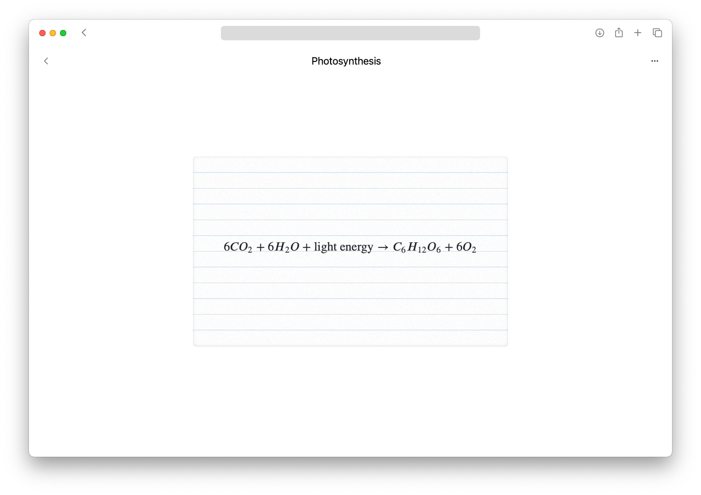

# Flashcard App

Our application is designed to generate educational STEM flashcards for high-school students. The application utilises proven study techniques including retrieval practice, and incremental rehearsal.



## Technologies used

- **Flask**: Back-end web framework.
- **MongoDB**: NoSQL database.
- **Bootstrap**: Front-end framework.
- **LangChain**: LLM integration framework.
- **Gemini**: The model used to generate content.
- **Docker**: For containerisation.

## Getting Started

### Prerequisites

- Docker ([Docker Desktop](https://www.docker.com/products/docker-desktop/) is recommended)
- Git ([GitHub Desktop](https://desktop.github.com/download/) is recommended)

### Installation

1. Clone the repository.

2. Build and run the application using Docker Compose

```sh
docker-compose up --build
```
